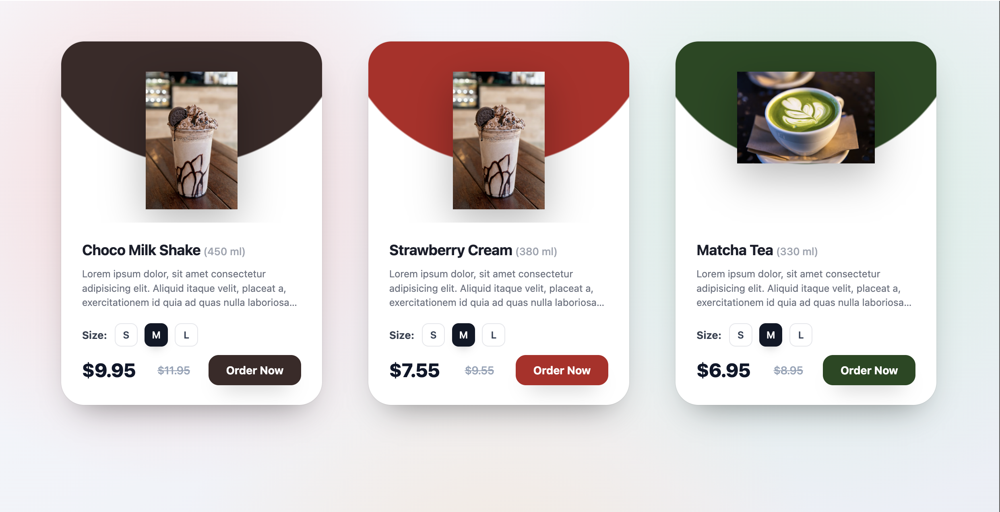

# 🍹 Product Card Component – React

A modern, responsive product card component built with React. Perfect for e‑commerce menus, beverage showcases, or any product listing that needs size selection, pricing (with original price strikethrough), and dynamic theming.



---

## ✨ Features

- 🎨 **Dynamic theming** – Each card can have a unique top‑section background color and button color.
- 🧃 **Size selection** – S / M / L toggle buttons with active state.
- 💰 **Price display** – Current price + original price (strikethrough).
- 📱 **Fully responsive** – Grid layout adapts to desktop, tablet, and mobile.
- 🖱️ **Smooth animations** – Hover effects and interactive feedback.
- 🧩 **Reusable component** – Pass data via props; easy to integrate with any API or data source.

---

## 🚀 Demo


---

## 📦 Installation

1. **Clone the repository** (or add the files to your existing React project):
   ```bash
   git clone https://github.com/your-username/product-card-project.git
   cd product-card-project